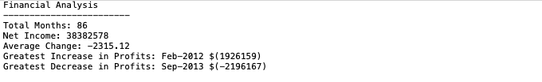
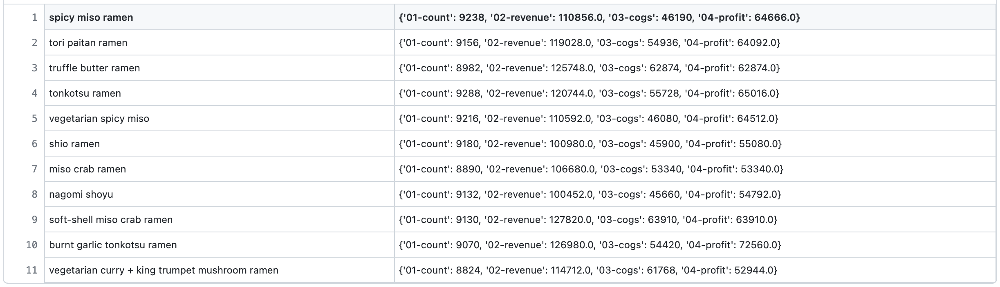

# Unit 2 | Homework Assignment
This repo is a short introduction to financial programming with python, no packages have been used for the data handling as it was designed to teach basic python understanding. Two problems are outlined below:

## PyBank
Required us to read and understand csv data, and perform computations on list like data sets. The required output was a final analysis.txt file summarising all computations.

---

## PyRaman
Required us to compare data across two csv files and perform counts of values from each. The required output was a final analysis.csv file summarising menu item counts/sums.

